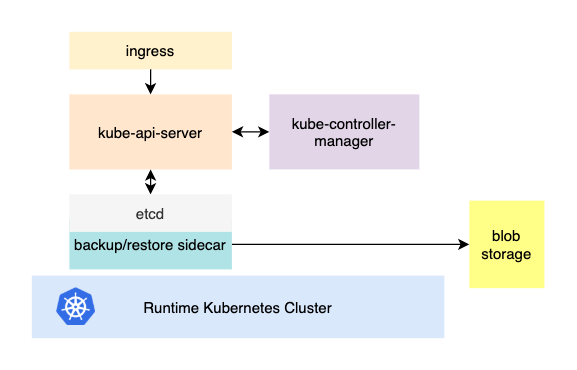

# Virtual Control Plane

The project contains a collection of helm charts to deploy a virtual/nodeless [Kubernetes API server](https://kubernetes.io/docs/reference/command-line-tools-reference/kube-apiserver/).

## Background

Why do we need such a thing as a nodeless Kubernetes cluster?

When developing a custom control plane by [extending Kubernetes](https://kubernetes.io/docs/concepts/extend-kubernetes/) and using the [Operator Pattern](https://kubernetes.io/docs/concepts/extend-kubernetes/operator/) we might be not really interested in objects such `Pods`, `Deployments` and others. The goal instead is to introduce new [CustomResourceDefinitions](https://kubernetes.io/docs/tasks/extend-kubernetes/custom-resources/custom-resource-definitions/) on which our controllers will operate by leveraging the concepts of Kubernetes API machinery.

In order to do it, we will need certain things such as:

- `etcd` server (ideally with a [backup and restore sidecar](https://github.com/gardener/etcd-backup-restore)[^1])
- `kube-api-server` and `kube-controller-manager`

Since this Kubernetes API server setup does not have any nodes, there is no need in `kube-scheduler` as we won't deploy any `Pods`.

Those components can be easily deployed on an existing Kubernetes cluster[^2].

The figure above illustrates the core components which are deployed on a _vanilla_ Kubernetes runtime cluster.

Now  your custom controllers can be deployed on the same (or different) runtime cluster as illustrated in the image above.

## Advantages

The main advantage of this approach is, that controllers and the content inside of virtual Kubernetes API server are no longer physically bound to the underlying runtime cluster as your CRDs are not mixed with content of the runtime clusters API server.

Since the virtual controlplane in our scenario is just another workload running in a Kubernetes cluster, it can be moved and restored to a different cluster in case disaster strikes and the runtime cluster becomes unavailable.

Another advantage is, that the performance of the virtual Kubernetes API server becomes a lot more predictable since nobody besides your controllers[^3] are working against it.

[^1]: In our setup we are reusing the great work from the [Gardener](https://gardener.cloud/) project.
[^2]: This can also be done on a classical virtual machine based setup.
[^3]: And maybe the `kube-controller-manager`.

--8<-- "hack/docs/abbreviations.md"