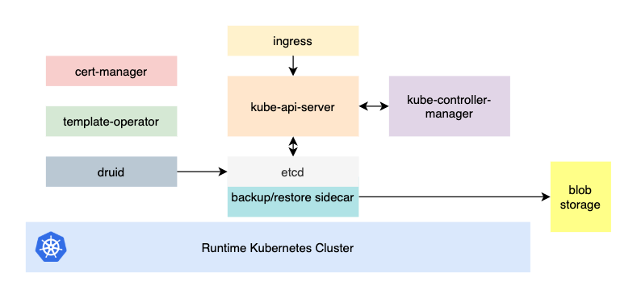

# Installation

This section describes all installation steps for `virtual-controlplane` into a Kubernetes cluster.

## Prerequisites

* helm
* kubectl
* Access to a Kubernetes cluster ([minikube](https://minikube.sigs.k8s.io/docs/), [kind](https://kind.sigs.k8s.io/) or a real one)

## Components

Required components to deploy the virtual control plane are depicted in the diagram below:

The utility controller in this setup is needed for the following tasks:

* `cert-manager`: Manages cluster wide CAs and certificates for the `kube-apiserver` and `etcd`
* `template-operator`: Generates in-cluster `kubeconfigs` from the genereated TLS certificates
* `druid`: Operator to deploy and manage the lifecycle of `etcd` clusters

## Installation

To install all the components mentioned above please follow the guides in the following order:

* [Configure Helm repository](/virtual-controlplane/usage/helm)
* [Install Cert-Manager](/virtual-controlplane/usage/cert-manager)
* [Install Druid](/virtual-controlplane/usage/druid)
* [Install Etcd](/virtual-controlplane/usage/etcd)
* [Install Template Operator](/virtual-controlplane/usage/template-operator)
* [Install Virtual Control Plane Components](/virtual-controlplane/usage/virtual-control-plane)

## Access API Server

Please follow the [Access API Server](/virtual-controlplane/usage/access) to access the virtual Kubernetes API server we just deployed.

--8<-- "hack/docs/abbreviations.md"
